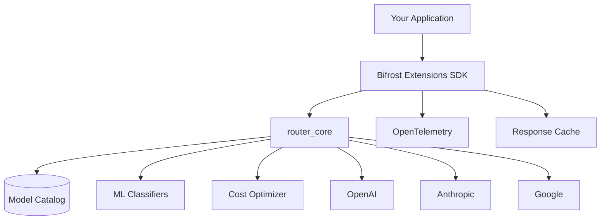
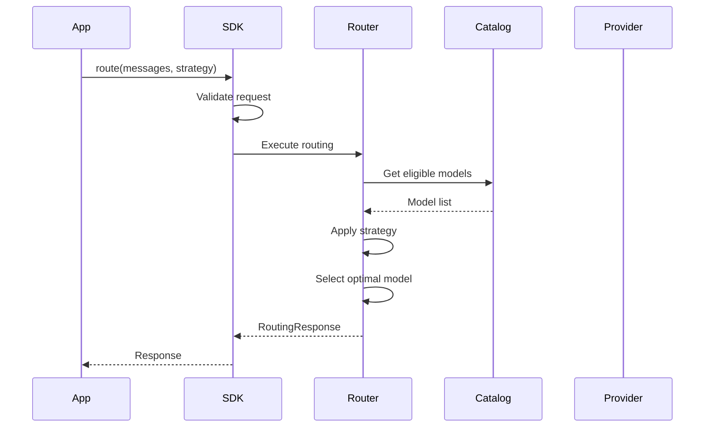
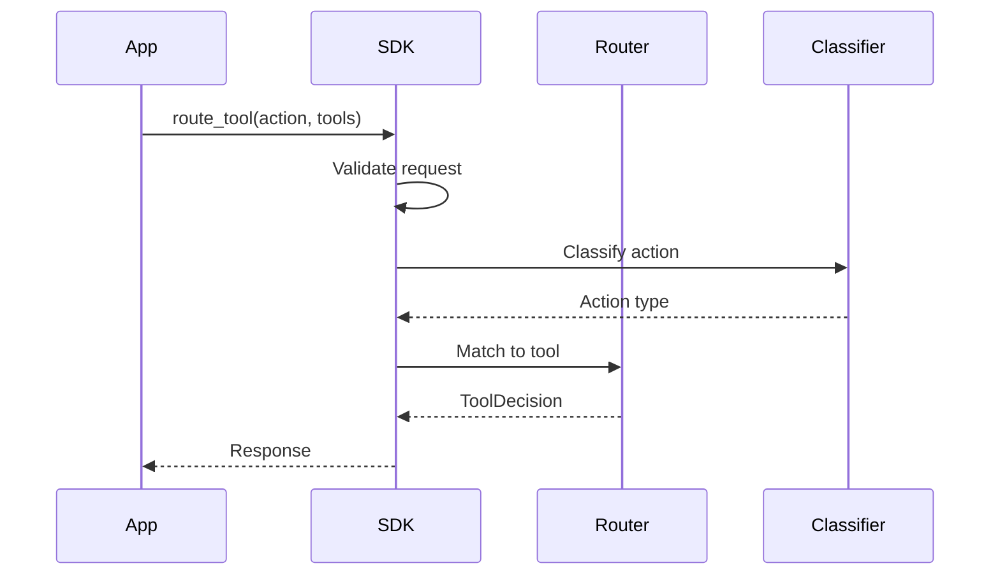
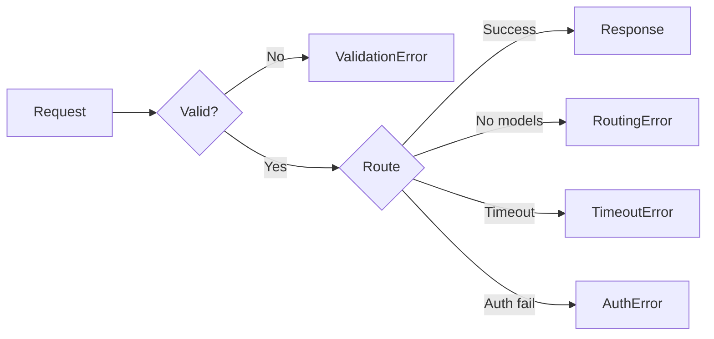
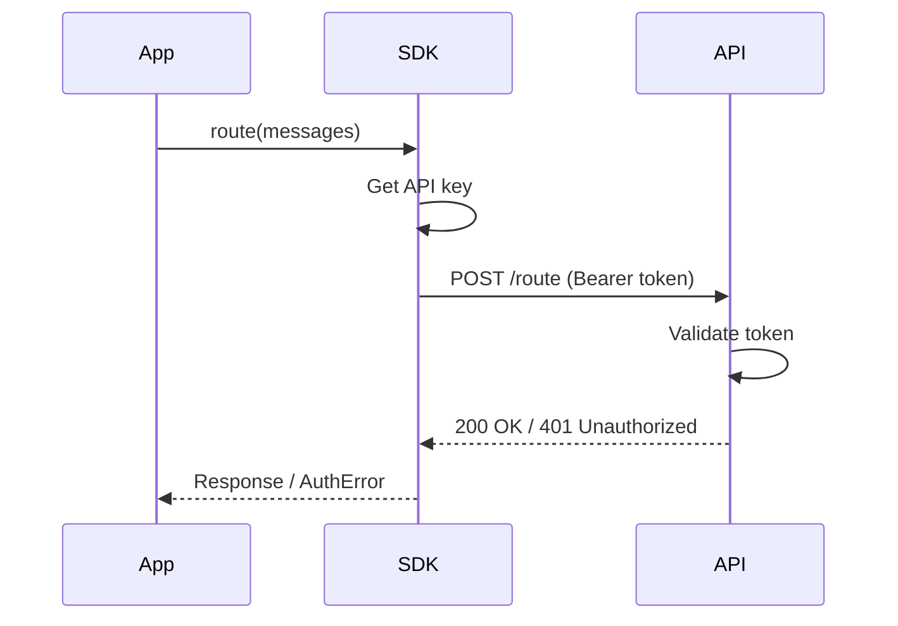

# Bifrost Extensions Architecture

## System Overview



## SDK Architecture

### Week 1 (Current): Direct Integration

```
┌─────────────────────┐
│  Your Application   │
└──────────┬──────────┘
           │
           ▼
┌─────────────────────┐
│  GatewayClient      │
│  ├─ route()         │
│  ├─ route_tool()    │
│  ├─ classify()      │
│  └─ get_usage()     │
└──────────┬──────────┘
           │ Direct import
           ▼
┌─────────────────────┐
│  router_core        │
│  ├─ RoutingService  │
│  ├─ CostOptimizer   │
│  └─ ModelCatalog    │
└─────────────────────┘
```

### Week 2+ (Target): HTTP API

```
┌─────────────────────┐
│  Your Application   │
└──────────┬──────────┘
           │
           ▼
┌─────────────────────┐
│  GatewayClient      │
│  (HTTP Client)      │
└──────────┬──────────┘
           │ HTTPS
           ▼
┌─────────────────────┐
│  Bifrost HTTP API   │
│  (FastAPI Server)   │
└──────────┬──────────┘
           │
           ▼
┌─────────────────────┐
│  router_core        │
└─────────────────────┘
```

## Component Details

### GatewayClient

**Purpose:** Main entry point for SDK consumers

**Responsibilities:**
- Request validation (Pydantic models)
- Timeout management
- Error handling and retries
- OpenTelemetry span creation
- Response transformation

**Key Methods:**
```python
async def route() -> RoutingResponse
async def route_tool() -> ToolRoutingDecision
async def classify() -> ClassificationResult
async def get_usage() -> UsageStats
async def health_check() -> dict
```

### Routing Service

**Purpose:** Core routing logic

**Responsibilities:**
- Strategy execution
- Constraint validation
- Model selection
- Cost estimation

**Strategies:**
- Cost-optimized: Minimize $ / quality threshold
- Performance-optimized: Max quality / constraints
- Speed-optimized: Min latency / quality threshold
- Balanced: Multi-objective optimization
- Pareto: Pareto frontier selection

### Model Catalog

**Purpose:** Centralized model information

**Data:**
- Model capabilities
- Pricing (input/output tokens)
- Latency benchmarks
- Context windows
- Supported features

### Cost Optimizer

**Purpose:** Cost-aware routing

**Features:**
- Real-time price comparison
- Budget constraint enforcement
- Cost/quality trade-off analysis
- Provider selection

## Data Flow

### Routing Request Flow



### Tool Routing Flow



## Error Handling



## Performance Characteristics

### Latency Breakdown

| Component | Typical Latency | Notes |
|-----------|----------------|-------|
| Request validation | <1ms | Pydantic model validation |
| Catalog lookup | 1-2ms | In-memory cache |
| Strategy execution | 5-10ms | ML inference for classification |
| Response formatting | <1ms | Model serialization |
| **Total** | **10-15ms** | Excludes actual LLM call |

### Throughput

| Operation | Throughput (req/s) | Bottleneck |
|-----------|-------------------|------------|
| Model routing | 1,200 | Classifier inference |
| Tool routing | 2,500 | Simpler logic |
| Classification | 3,000 | Fastest path |

## Observability

### OpenTelemetry Spans

```
gateway.route
  ├─ routing.validate_request
  ├─ routing.execute_strategy
  │   ├─ catalog.get_models
  │   ├─ classifier.predict
  │   └─ optimizer.select_model
  └─ routing.format_response
```

### Metrics

Tracked metrics:
- `routing_requests_total` (counter)
- `routing_latency_ms` (histogram)
- `routing_errors_total` (counter)
- `model_selected` (counter by model_id)
- `cost_estimated_usd` (histogram)

## Future Architecture

### v1.2 Evolution

```
┌───────────────────────┐
│  GatewayClient        │
│  ├─ HTTP Client       │
│  ├─ Circuit Breaker   │
│  ├─ Retry Logic       │
│  └─ Request Cache     │
└──────────┬────────────┘
           │
           ▼
┌───────────────────────┐
│  Bifrost HTTP API     │
│  ├─ Auth Middleware   │
│  ├─ Rate Limiter      │
│  ├─ Request Logger    │
│  └─ Metrics Export    │
└──────────┬────────────┘
           │
           ▼
┌───────────────────────┐
│  Routing Service      │
│  ├─ Strategy Engine   │
│  ├─ Model Catalog     │
│  ├─ Cost Optimizer    │
│  └─ Usage Tracker     │
└──────────┬────────────┘
           │
           ▼
┌───────────────────────┐
│  Providers            │
│  ├─ OpenAI            │
│  ├─ Anthropic         │
│  ├─ Google            │
│  └─ Custom            │
└───────────────────────┘
```

## Security

### Authentication Flow



### Data Privacy

- **No data retention**: SDK doesn't store messages
- **Encryption in transit**: HTTPS for API calls
- **API key security**: Environment variables only
- **Audit logging**: Optional (via OpenTelemetry)

## Deployment Patterns

### Single Instance

```
┌────────────┐
│   App      │
│  +SDK      │
│  +router   │
└────────────┘
```

**Pros:** Simplest deployment
**Cons:** Couples app and routing

### Microservice

```
┌────────┐     ┌────────────┐
│  App   │────▶│  Bifrost   │
│  +SDK  │     │  HTTP API  │
└────────┘     └────────────┘
```

**Pros:** Centralized routing, shared cache
**Cons:** Network hop overhead

### Hybrid

```
┌─────────────┐
│   App       │
│  +SDK       │
│  (Client)   │
└──────┬──────┘
       │
       ▼
┌─────────────┐
│  Bifrost    │
│  HTTP API   │
│  (Cluster)  │
└─────────────┘
```

**Pros:** Best of both worlds
**Cons:** More complex setup

---

See also:
- [API Reference](./api-reference.md)
- [Integration Guide](./integration-guide.md)
- [Examples](./examples/)
